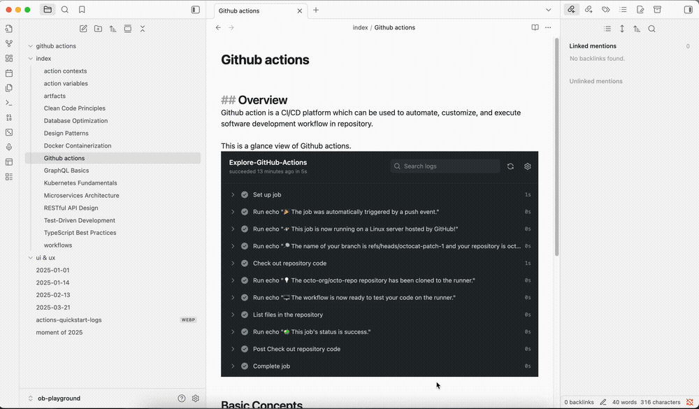

# Obsidian Related Move Files

move file and all the related files (inlinks) in the file tree to a new folder. Which can be used to organize your obsidian vault quickly.

## Example

If your `github action related files` are scattered everywhere in your vault, you can use this plugin to move them to a new folder.

- First: Create a new folder in your vault, for example: `github-action`.
- Second: Select the root file of the `github action related files`
- Third: Select `Related Move` menu item in the file context menu or editor context menu.
- Fourth: Select the new folder you created in the modal.
- Fifth: Click `Confirm` button to move the files.

That's it. All the `github action related files` will be moved to the new folder.

## Features

- Move file and all the related files (inlinks) in the file tree to a new folder.
- Support related select and cascade select.
- Support move files to a new folder.
- i18n support.

## Installation

### Manual Installation

1. Download the latest release from [GitHub Releases](https://github.com/your-username/obsidian-related-move-files/releases).
2. Download the `main.js`, `manifest.json`, `styles.css` files from the release.
3. Create a new folder named `related-move` in your Obsidian plugins folder.
4. Copy the `main.js`, `manifest.json`, `styles.css` files to the `related-move` folder.
5. Restart Obsidian.
6. Enable the plugin in the Obsidian settings.

### Community Plugin Manager(Not Published Yet)

1. Search for "Related Move" in the Community Plugin Manager.
2. Click "Install" to install the plugin.
3. Enable the plugin in the Obsidian settings.
4. Restart Obsidian.
